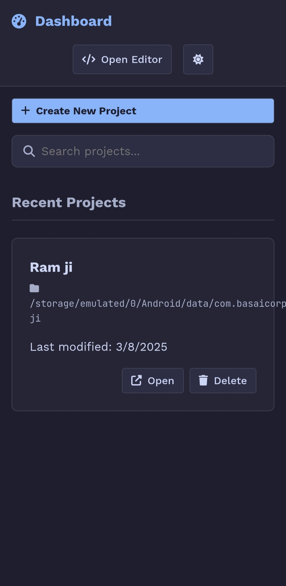
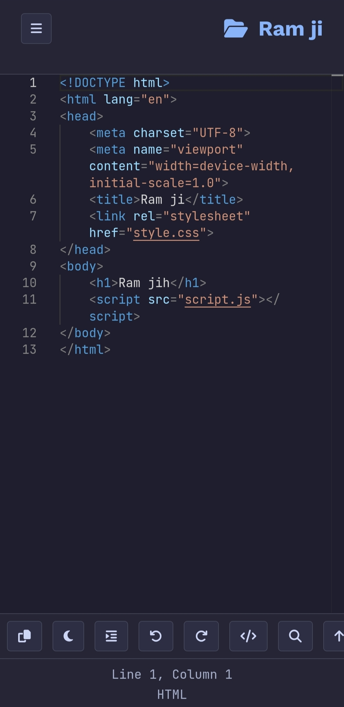
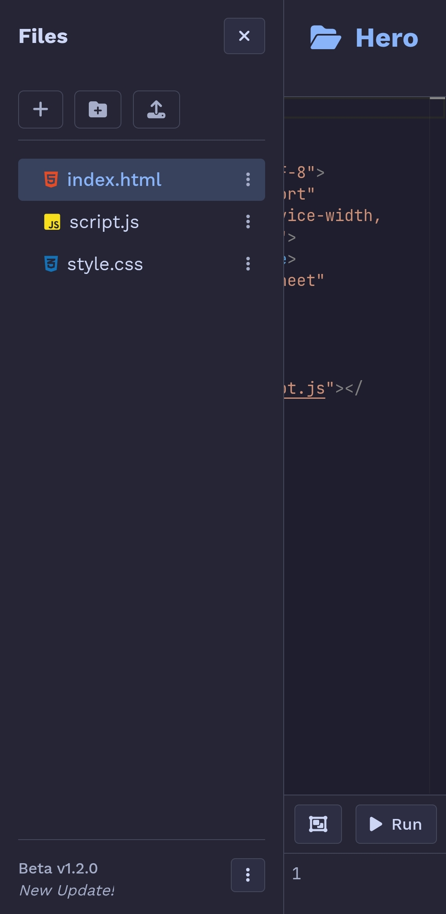
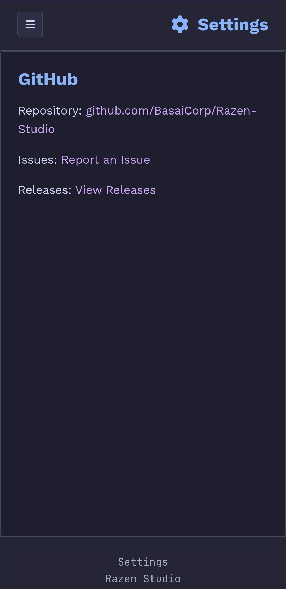

# Razen Studio

Razen Studio is a modern code editor specifically designed for the Razen Lang programming language. Built with HTML, CSS, and JavaScript, it offers a clean and efficient environment for coding.


### Dashboard Screen


### Editor Screen 


### Files Tree/Sidebar


### Settings/Info Screen



## Features

*   **Code Editing:** A core text editor for Razen Lang.
*   **Syntax Highlighting:** Basic syntax highlighting for better readability (using Prism.js).
*   **File Management:** Create and manage multiple files within the editor.
*   **Themes:** Supports both Light and Dark themes, respecting system preferences.
*   **Sidebar Navigation:** Easy access to files and settings via a collapsible sidebar.
*   **Editor Tools:** Includes common tools like Copy, Tab handling, Undo/Redo, and Bracket insertion.
*   **Search & Replace:** Basic find and replace functionality.
*   **Settings Panel:** A dedicated settings area for project information.
*   **Android App:** Razen Studio is also available as an Android application. You can download the latest version from the [Releases page](https://github.com/BasaiCorp/Razen-Studio/releases).

## Getting Started

These instructions will get you a copy of the project up and running on your local machine.

### Prerequisites

A modern web browser (Chrome, Firefox, Edge, Safari, etc.)

### Installation

1.  Clone or download this repository to your local machine.
    ```bash
    git clone https://github.com/BasaiCorp/Razen-Studio.git
    ```
2.  Navigate to the project directory.
3.  Open `index.html` in your preferred web browser.

## Usage

1.  **Opening the Editor:** Simply open `index.html` in a web browser.
2.  **Creating Files:** Click the "New File" button in the sidebar.
3.  **Editing Code:** Type your Razen Lang code into the editor area.
4.  **Using Tools:** Utilize the buttons in the toolbar below the editor for common actions.
5.  **Changing Themes:** Click the "Dark" or "Light" button in the toolbar to toggle themes.
6.  **Accessing Settings:** Click the cog icon (`fa-cog`) in the sidebar or navigate to `settings.html` to view project information like GitHub links, version, changelogs, license, and about details.

## Project Structure

```
Razen-Studio/
├── Android/
├── autocomplete.json
├── dashboard.css
├── dashboard.html
├── dashboard.js
├── filesystem.js
├── index.html
├── keywords.json
├── LICENCE
├── preview.css
├── preview.html
├── preview.js
├── README.md
├── Screenshot1.jpg
├── Screenshot2.jpg
├── Screenshot3.jpg
├── Screenshot4.jpg
├── script.js
├── settings.css
├── settings.html
├── settings.js
├── storage.js
└── style.css
```

## Settings

The `settings.html` page provides information about the Razen Studio project:

*   **GitHub:** Links to the repository, issues, and releases.
*   **Version:** Displays the current version (Beta v1.2.0).
*   **Changelogs:** Lists recent changes and updates.
*   **License:** Shows the project's license (MIT).
*   **About:** Provides a brief description and developer information.

Navigation between these sections is handled via the sidebar within the settings page.

## Built With

*   **HTML5**
*   **CSS3** (Variables for theming)
*   **JavaScript** (Vanilla JS for core logic)
*   **Monaco Editor (VSCode Engine)** - Code Editor Engine
*   **[Font Awesome](https://fontawesome.com/)** - Icons
*   **[Google Fonts](https://fonts.google.com/)** - Work Sans, JetBrains Mono
*   **Java** (Used for Android App Logic)

## Contributing

Contributions are welcome! Please feel free to submit issues or pull requests to the [GitHub repository](https://github.com/BasaiCorp/Razen-Studio).

## Versioning

We use [SemVer](http://semver.org/) for versioning. For the versions available, see the [releases page](https://github.com/BasaiCorp/Razen-Studio/releases).

## Authors

*   **Prathmesh Barot** - *Initial work* - [BasaiCorp](https://github.com/BasaiCorp)

## License

This project is licensed under the MIT License - see the [LICENSE](LICENCE) file for details.

## Acknowledgments

*   Inspiration from other modern code editors.